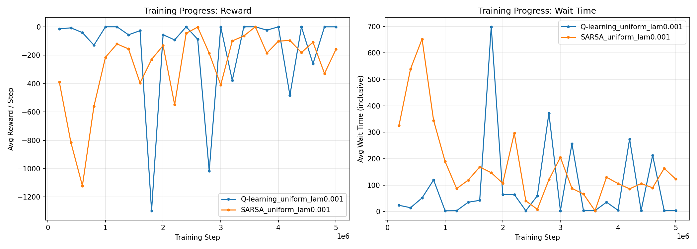
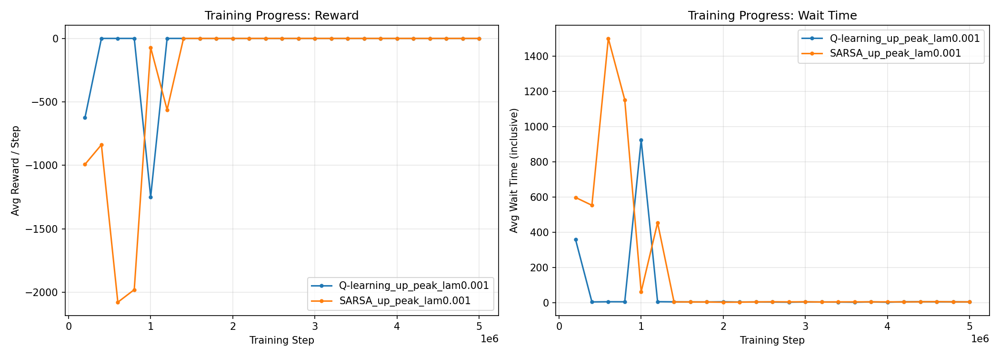
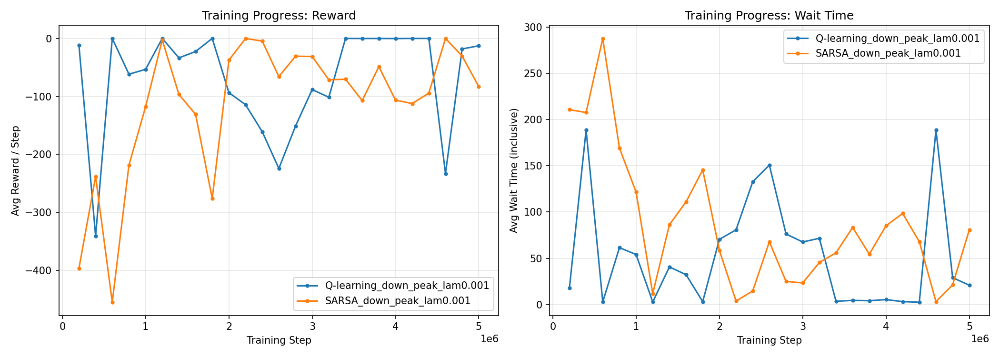
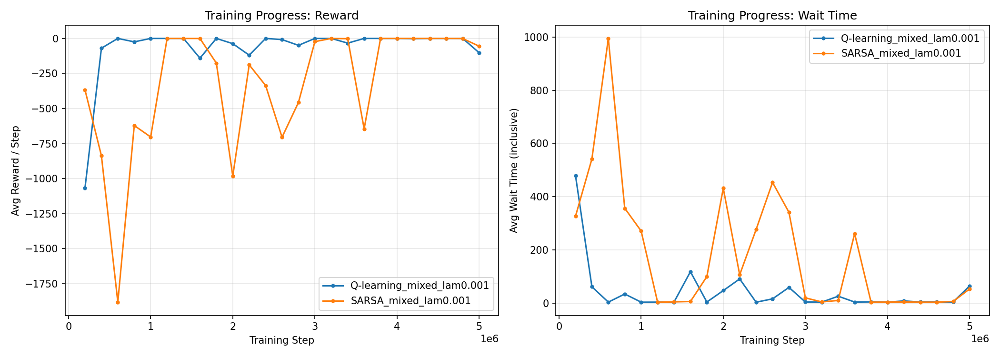
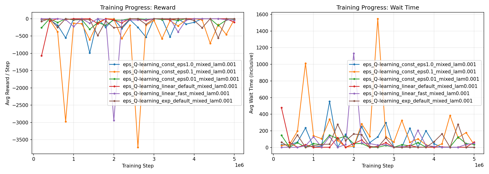
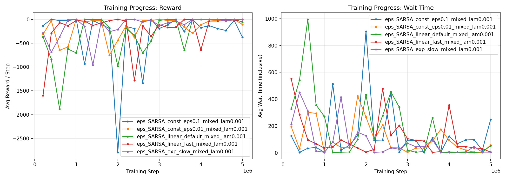
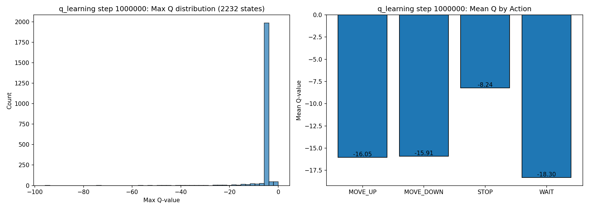
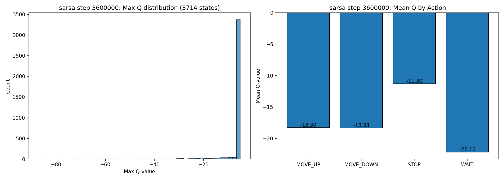

# Tabular Reinforcement Learning for Elevator Control

This project applies **tabular Q-learning** and **SARSA** to the single-elevator dispatching problem. The elevator operates in a 5-floor building, deciding at each time step whether to move up, move down, stop (to pick up/drop off passengers), or wait. The goal is to minimize passenger waiting times through learned policies, and to compare the two RL algorithms against classical heuristic baselines.

---

## Table of Contents

1. [Repository Structure](#1-repository-structure)
2. [Installation & Usage](#2-installation--usage)
3. [The Elevator Environment](#3-the-elevator-environment)
4. [Algorithms](#4-algorithms)
5. [Baseline Policies](#5-baseline-policies)
6. [Experiments](#6-experiments)
7. [Results](#7-results)
8. [References](#8-references)

---

## 1. Repository Structure

```
Tabular RL/
├── src/
│   ├── __init__.py
│   ├── config.py                  # TrainConfig dataclass
│   ├── env/
│   │   ├── __init__.py
│   │   ├── constants.py           # Action/direction enums
│   │   ├── passenger.py           # Passenger data class
│   │   └── elevator_env.py        # Full environment simulator
│   ├── agents/
│   │   ├── __init__.py
│   │   ├── base_agent.py          # Abstract RL agent
│   │   ├── q_learning.py          # Q-learning agent
│   │   ├── sarsa.py               # SARSA agent
│   │   └── state_encoding.py      # State → index mapping
│   ├── policies/
│   │   ├── __init__.py
│   │   ├── random_policy.py       # Random baseline
│   │   ├── scan_policy.py         # SCAN (elevator algorithm)
│   │   ├── look_policy.py         # LOOK (demand-aware SCAN)
│   │   └── nearest_call.py        # Nearest-call heuristic
│   ├── utils/
│   │   ├── __init__.py
│   │   ├── helpers.py             # Bitmask call-detection helpers
│   │   ├── evaluation.py          # Policy evaluation & printing
│   │   └── storage.py             # Save/load Q-tables & metadata
│   ├── train.py                   # Train a single agent
│   ├── compare.py                 # Load & compare saved agents
│   ├── visualize.py               # Plot training curves & Q-values
│   ├── experiments.py             # Full experiment suite
│   └── experiments_epsilon.py     # Epsilon-decay ablation study
└── results/                       # Auto-created output directory
    ├── <run_name>/
    │   ├── config.json            # Training configuration
    │   ├── best.npz               # Best Q-table + metadata
    │   ├── eval_history.json      # Evaluation metrics over training
    │   └── checkpoints/
    │       ├── step_00500000.npz
    │       ├── step_01000000.npz
    │       └── ...
    └── _epsilon_summary/
        └── epsilon_ablation_mixed.json
```

### Running the Code

All scripts are executed as Python modules from the project root (`Tabular RL/`):

```bash
# Run the full experiment suite (all traffic patterns)
python -m src.experiments

# Quick test with fewer steps
python -m src.experiments --train_steps 500000 --no_checkpoints

# Run only specific experiment groups
python -m src.experiments --only_groups primary mixed

# Train a single agent
python -m src.train --agent q_learning --lam 0.05 --traffic uniform

# Train both agents on a specific configuration
python -m src.train --agent both --lam 0.001 --traffic mixed

# Run the epsilon-decay ablation study
python -m src.experiments_epsilon
python -m src.experiments_epsilon --train_steps 2000000 --agent q_learning

# Compare saved models against baselines
python -m src.compare results/Q-learning_uniform_lam0.001/best.npz \
                      results/SARSA_uniform_lam0.001/best.npz \
                      --lam 0.001 --traffic uniform

# Visualize training curves
python -m src.visualize results/Q-learning_uniform_lam0.001 \
                        results/SARSA_uniform_lam0.001

# Visualize Q-value distribution from a checkpoint
python -m src.visualize dummy --q_heatmap results/Q-learning_uniform_lam0.001/best.npz
```

---

## 2. Installation & Usage

### Requirements

- Python 3.8+
- NumPy
- Matplotlib (optional, for visualization only)

```bash
pip install numpy matplotlib
```

### Quick Start

```bash
# Clone / navigate to project root
cd "Tabular RL"

# Run primary experiment (Q-learning vs SARSA, uniform traffic)
python -m src.experiments --only_groups primary --train_steps 1000000

# Compare the trained agents
python -m src.compare results/Q-learning_uniform_lam0.001/best.npz \
                      results/SARSA_uniform_lam0.001/best.npz \
                      --lam 0.001

# Visualize learning progress
python -m src.visualize results/Q-learning_uniform_lam0.001 \
                        results/SARSA_uniform_lam0.001
```

---

## 3. The Elevator Environment

### 3.1 Problem Description

We model a single elevator serving a 5-floor building (floors 0–4). Passengers arrive stochastically at each floor, each with a random destination. The elevator controller must decide, at every discrete time step, which action to take. The objective is to **minimize the total waiting time** experienced by all passengers.

This is a **sequential decision-making problem under uncertainty**: the controller does not know when or where future passengers will appear, making it a natural fit for reinforcement learning.

### 3.2 State Space

The state is a 6-tuple:

$$s = (\text{floor}, \text{direction}, \text{up\\_calls}, \text{down\\_calls}, \text{car\\_calls}, \text{num\\_passengers})$$

| Component | Range | Description |
|---|---|---|
| `floor` | $\{0, 1, 2, 3, 4\}$ | Current floor of the elevator car |
| `direction` | $\{\text{DOWN}, \text{IDLE}, \text{UP}\}$ | Last movement direction of the car |
| `up_calls` | $\{0, \ldots, 15\}$ | 4-bit mask: floors 0–3 with passengers waiting to go up |
| `down_calls` | $\{0, \ldots, 15\}$ | 4-bit mask: floors 1–4 with passengers waiting to go down |
| `car_calls` | $\{0, \ldots, 31\}$ | 5-bit mask: destination floors of onboard passengers |
| `num_passengers` | $\{0, \ldots, 5\}$ | Count of passengers currently in the car |

The `direction` component records the car's last movement: `UP` if the last action was `MOVE_UP`, `DOWN` if it was `MOVE_DOWN`, and `IDLE` if the last action was `STOP` or `WAIT`. This is important because the `STOP` action uses the current direction to decide which queue to serve — an upward-traveling car picks up passengers going up, a downward-traveling car picks up passengers going down, and an idle car picks up both.

Not all combinations of `car_calls` and `num_passengers` are valid (the number of set bits in `car_calls` cannot exceed `num_passengers`). Accounting for this constraint yields **112** valid `(car_calls, num_passengers)` pairs, giving a total state space of:

$$|\mathcal{S}| = 5 \times 3 \times 16 \times 16 \times 112 = 430{,}080 \text{ states}$$

### 3.3 Action Space

At each time step the controller selects one of four actions:

$$\mathcal{A} = \{\text{MOVE\\_UP},\; \text{MOVE\\_DOWN},\; \text{STOP},\; \text{WAIT}\}$$

| Action | Effect |
|---|---|
| `MOVE_UP` | Move one floor up (invalid at floor 4) |
| `MOVE_DOWN` | Move one floor down (invalid at floor 0) |
| `STOP` | Open doors: drop off passengers whose destination is this floor, then pick up waiting passengers (respecting capacity and direction). Invalid if no one to drop off and no one waiting. |
| `WAIT` | Stay at current floor, doors closed. Always valid. |

Action validity is context-dependent: `MOVE_UP` is unavailable at the top floor, `MOVE_DOWN` at the bottom, and `STOP` only when there are passengers to serve.

### 3.4 Stochastic Dynamics

The environment is **non-deterministic** due to the Poisson passenger arrival process. At each time step, for each floor $f$, the number of new arrivals is drawn from:

$$N_f \sim \text{Poisson}(\lambda \cdot p_f \cdot F)$$

where:
- $\lambda$ is the **global arrival rate** parameter (passengers per floor per time step, on average),
- $p_f$ is the **floor arrival probability** (depends on the traffic pattern),
- $F = 5$ is the number of floors.

Each arriving passenger's destination is sampled from a floor-specific distribution $\text{Dest}(f)$ that depends on the traffic pattern.

**Consequence for RL:** Because the same state-action pair can lead to different next states (depending on who arrives), the transition function $P(s' | s, a)$ is stochastic. The agent must learn a policy that performs well **in expectation** over these random arrivals.

### 3.5 The $\lambda$ Parameter

The parameter $\lambda$ (lambda) controls the **traffic intensity** — the expected number of passenger arrivals per floor per time step. It is the single most important parameter governing problem difficulty:

| $\lambda$ | Traffic Level | Behavior |
|---|---|---|
| 0.001 | Very low | Passengers arrive rarely (~1 every 200 steps); elevator is idle most of the time. All policies can serve everyone. |
| 0.005 | Low | Light but steady flow; good policies keep queues empty, poor policies begin to accumulate delays. |
| 0.01 | Moderate | Continuous demand; even heuristic baselines leave passengers in queues at evaluation end. Queues grow under suboptimal policies. |
| 0.05 | High | Heavy traffic; the elevator is nearly always occupied. All policies struggle with capacity limits; queue management becomes critical. |
| 0.1 | Very high | Arrival rate exceeds service capacity. Queues grow unboundedly regardless of policy. Only useful for stress testing. |

At $\lambda = 0.001$ with 5 floors, the expected total arrival rate across all floors is $\lambda \times F = 0.005$ passengers per time step, or roughly one passenger every 200 steps. At $\lambda = 0.01$, this rises to one passenger every 20 steps — enough that the elevator must work continuously and even well-designed heuristics (LOOK, Nearest Call) leave 1–2 passengers unserved at the end of a 10,000-step evaluation.

The transition from $\lambda = 0.001$ to $\lambda = 0.01$ represents the boundary of what our tabular RL agents can handle: at $\lambda = 0.001$ they outperform all baselines, while at $\lambda = 0.01$ they fail catastrophically (see §7.5 and §7.10).

### 3.6 Traffic Patterns

The traffic pattern determines **where passengers appear** and **where they want to go**. Four patterns are implemented:

#### Uniform
All floors are equally likely origins and destinations.
- $p_f = 1/5$ for all floors
- $P(\text{dest} = j \mid \text{origin} = f) = 1/4$ for all $j \neq f$

This is the simplest pattern with no directional bias.

#### Up-Peak
Simulates morning rush hour: most passengers start at the ground floor and go up.
- $p_0 = 0.6$, other floors $p_f = 0.1$
- From floor 0: destinations biased toward upper floors $(0.15, 0.25, 0.30, 0.30)$
- From other floors: uniform destinations

The optimal strategy tends to involve frequent returns to the ground floor.

#### Down-Peak
Simulates evening rush hour: most passengers are on upper floors heading to ground.
- $p_f$ biased toward upper floors: $(0.05, 0.15, 0.20, 0.30, 0.30)$
- From upper floors: 70% probability of going to floor 0
- From floor 0: uniform destinations

The optimal strategy collects passengers from upper floors and delivers them to ground.

#### Mixed
Simulates a building with a busy lobby and moderate inter-floor traffic.
- $p_f$: $(0.35, 0.15, 0.15, 0.15, 0.20)$
- From non-ground floors: ground floor is 3× more likely as destination
- From ground floor: uniform upward distribution

This pattern presents the most complex optimization challenge, as the elevator must balance lobby service with inter-floor trips.

### 3.7 Reward Function

The reward at each step is the negative sum of accumulated waiting times across all active hall calls, plus a penalty for each active car call:

$$R_t = -\sum_{f=0}^{4} \left[ \mathbb{1}[\text{up\\_button}_f \text{ active}] \cdot (t - t_{\text{up\\_pressed}}^{f}) + \mathbb{1}[\text{down\\_button}_f \text{ active}] \cdot (t - t_{\text{down\\_pressed}}^{f}) \right] - \sum_{f=0}^{4} \mathbb{1}[\text{car\\_call}_f \text{ active}]$$

This reward is **always non-positive**: zero is the best possible (no one waiting). The longer people wait, the more negative the reward becomes, growing quadratically with waiting time. This strongly incentivizes the agent to serve passengers quickly.

---

## 4. Algorithms

We apply two classical tabular RL algorithms: **Q-learning** (off-policy) and **SARSA** (on-policy). Both maintain a table $Q(s, a)$ for every state-action pair and update it incrementally from experience.

### 4.1 Q-Learning (Off-Policy)

Q-learning directly estimates the **optimal** action-value function $Q^*(s, a)$, regardless of the policy being followed during training.

**Update rule:**

$$Q(s_t, a_t) \leftarrow Q(s_t, a_t) + \alpha \Big[ r_{t+1} + \gamma \max_{a'} Q(s_{t+1}, a') - Q(s_t, a_t) \Big]$$

The key feature is the $\max$ operator in the target: the update always uses the **best** possible next action, even if the agent actually chose a different (exploratory) action. This is analogous to **value iteration** in dynamic programming:

$$V^*(s) = \max_a \left[ R(s, a) + \gamma \sum_{s'} P(s' | s, a) V^*(s') \right]$$

**Properties:**
- **Off-policy**: Learns the optimal policy while following any exploratory policy
- **Optimistic**: Q-values reflect the best-case future, ignoring exploration costs
- Converges to $Q^*$ under standard conditions (all state-action pairs visited infinitely often, appropriate learning rate decay)

### 4.2 SARSA (On-Policy)

SARSA estimates the action-value function of the **current** policy $Q^\pi(s, a)$, including its exploratory behavior.

**Update rule:**

$$Q(s_t, a_t) \leftarrow Q(s_t, a_t) + \alpha \left[ r_{t+1} + \gamma \, Q(s_{t+1}, a_{t+1}) - Q(s_t, a_t) \right]$$

The critical difference: instead of $\max_{a'} Q(s_{t+1}, a')$, SARSA uses $Q(s_{t+1}, a_{t+1})$ — the Q-value of the action **actually taken** in the next state. The name SARSA comes from the quintuple $(S_t, A_t, R_{t+1}, S_{t+1}, A_{t+1})$ used in each update. This is analogous to **policy iteration**:

$$Q^\pi(s, a) = R(s, a) + \gamma \sum_{s'} P(s' | s, a) Q^\pi(s', \pi(s'))$$

**Properties:**
- **On-policy**: Learns the value of the policy it is currently following
- **Conservative**: Q-values account for future exploratory (random) actions, making them slightly pessimistic
- As $\varepsilon \to 0$, SARSA converges to the same values as Q-learning

### 4.3 Hyperparameters

Both algorithms share the following hyperparameters:

| Symbol | Name | Role |
|---|---|---|
| $\alpha$ | Learning rate | Step size for Q-value updates; $\alpha = 0.1$ used throughout |
| $\gamma$ | Discount factor | Weight on future rewards; $\gamma = 0.99$ values long-term performance |
| $\varepsilon$ | Exploration rate | Probability of random action (see §4.4) |
| $Q_0$ | Initial Q-values | All entries initialized to $-5.0$ (optimistic relative to typical rewards encourages exploration) |

### 4.4 Epsilon-Greedy Exploration and Decay

Both agents use an $\varepsilon$-greedy policy during training:

$$a_t = \begin{cases} \text{random action from } \mathcal{A}_\text{valid} & \text{with probability } \varepsilon \\ \arg\max_{a \in \mathcal{A}_\text{valid}} Q(s_t, a) & \text{with probability } 1 - \varepsilon \end{cases}$$

**Why exploration matters:** Without exploration, the agent would never try new actions and could get stuck with a suboptimal policy. With too much exploration, the agent wastes time on random actions and learns slowly. The $\varepsilon$ parameter balances this **exploration-exploitation tradeoff**.

**Epsilon decay** gradually shifts from exploration to exploitation as training progresses:

#### No Decay (Constant $\varepsilon$)

$$\varepsilon_t = \varepsilon_0 \quad \forall \, t$$

The exploration rate never changes. If $\varepsilon_0$ is high, the agent explores forever and never fully exploits its knowledge. If $\varepsilon_0$ is low, it may converge prematurely to a suboptimal policy.

#### Linear Decay

$$\varepsilon_t = \varepsilon_{\text{start}} + (\varepsilon_{\text{end}} - \varepsilon_{\text{start}}) \cdot \min\!\left(1, \frac{t}{T_{\text{decay}}}\right)$$

The exploration rate decreases linearly from $\varepsilon_{\text{start}}$ to $\varepsilon_{\text{end}}$ over the first $T_{\text{decay}}$ steps, then remains constant at $\varepsilon_{\text{end}}$. This is the **default strategy** used in our primary experiments ($\varepsilon: 1.0 \to 0.01$ over 50% of training).

#### Exponential (Multiplicative) Decay

$$\varepsilon_t = \max\!\left(\varepsilon_{\text{end}}, \; \varepsilon_{\text{start}} \cdot \rho^{\,t}\right)$$

where the decay rate $\rho$ is computed to reach $\varepsilon_{\text{end}}$ at a target step $T$:

$$\rho = \left(\frac{\varepsilon_{\text{end}}}{\varepsilon_{\text{start}}}\right)^{1/T}$$

Exponential decay reduces exploration more aggressively in early training and more gradually later, spending more total time near the final $\varepsilon_{\text{end}}$.

---

## 5. Baseline Policies

We compare RL agents against four heuristic baselines that require no learning:

### 5.1 Random

Selects uniformly at random from valid actions at each step. This is the worst reasonable baseline and establishes a lower bound on performance.

### 5.2 SCAN (Elevator Algorithm)

The classical elevator algorithm. The car sweeps continuously between the bottom and top floors, reversing direction only at the extremes. It stops to pick up or drop off passengers when their direction matches the current sweep direction.

- **Advantage:** Simple, fair, bounded waiting time
- **Disadvantage:** Makes unnecessary trips when no calls exist in the sweep direction

### 5.3 LOOK

An improvement over SCAN: instead of always traveling to the extreme floor, the car reverses direction when there are **no more calls** ahead in the current direction. This avoids wasteful trips to empty floors.

- **Advantage:** More responsive than SCAN
- **Disadvantage:** Still follows a fixed directional policy

### 5.4 Nearest Call

A greedy heuristic that always moves toward the **closest active call** (prioritizing car calls over hall calls). When multiple calls are equidistant, it picks one arbitrarily.

- **Advantage:** Minimizes immediate travel distance
- **Disadvantage:** Can oscillate between nearby floors while distant passengers accumulate long waits (starvation)

---

## 6. Experiments

### 6.1 Training Procedure

Training follows an online, single-stream interaction loop. A single environment instance runs continuously, and the agent updates its Q-table after every time step. The procedure differs slightly between Q-learning and SARSA due to their on-policy vs off-policy nature:

**Q-learning loop:**
```
initialize environment, observe state s
loop for each step:
    choose action a from s using ε-greedy
    take action a, observe reward r, next state s'
    update: Q(s,a) ← Q(s,a) + α[r + γ max_a' Q(s',a') - Q(s,a)]
    s ← s'
```

**SARSA loop:**
```
initialize environment, observe state s
choose action a from s using ε-greedy
loop for each step:
    take action a, observe reward r, next state s'
    choose next action a' from s' using ε-greedy
    update: Q(s,a) ← Q(s,a) + α[r + γ Q(s',a') - Q(s,a)]
    s ← s', a ← a'
```

The key difference is that SARSA must select the next action **before** the update (since the update depends on it), whereas Q-learning can select the next action at any time (since the update uses max).

#### Environment Resets

The environment is **reset every 50,000 steps** during training. A reset clears all passenger queues, empties the elevator car, returns the car to floor 0, and sets the direction to IDLE. The time counter resets to zero.

Resets serve two purposes:

1. **Preventing state drift.** Without resets, the continuous Poisson arrival process can occasionally create pathological situations — especially during early training when the agent acts nearly randomly ($\varepsilon \approx 1.0$). Random actions cause passengers to accumulate in long queues, the reward becomes an enormous negative constant, and the Q-value updates become dominated by these extreme penalties. The agent gets trapped learning about "recovery from disaster" rather than "normal efficient operation."

2. **Diversifying initial conditions.** By periodically starting from an empty building, the agent encounters the common trajectory of states that arise when the system is lightly loaded — which is the regime where its learned policy will actually be deployed during evaluation. Without resets, the agent at low $\lambda$ would spend most of training in states with zero or one pending call (since it eventually learns to serve them quickly), and rarely practice the more complex multi-call scenarios that occur right after a fresh start or a burst of arrivals.

The reset interval of 50,000 steps was chosen to balance these concerns: long enough for the agent to experience sustained multi-passenger scenarios, short enough to prevent runaway queue accumulation during early random exploration.

#### Evaluation During Training

Every 200,000 training steps, the current policy is evaluated **greedily** ($\varepsilon = 0$) on a separate environment instance with a fixed random seed. This evaluation runs for 10,000 steps and measures average reward, wait times, and throughput. The Q-table that achieves the highest average reward during any evaluation checkpoint is saved as the "best" model.

Using a fixed evaluation seed ensures that all checkpoints and all agents are compared on the **exact same sequence of passenger arrivals**, eliminating variance from the stochastic arrival process.

#### Checkpoint Saving

The training loop saves the full Q-table at two granularities:

- **Periodic checkpoints** every 500,000 steps: these capture the agent's knowledge at intermediate stages and enable post-hoc analysis of learning dynamics (e.g., how Q-value distributions evolve, when the agent first discovers good behaviors).
- **Best checkpoint**: overwritten whenever a new evaluation sets a record for highest average reward. This is the model used in final comparisons.

Each saved file (`.npz`) contains the Q-table array alongside a JSON metadata blob recording all hyperparameters, the training configuration, the current epsilon value, and (for the best checkpoint) the evaluation metrics at that point.

### 6.2 Primary Experiments (`experiments.py`)

The main experiment suite trains both Q-learning and SARSA across all configurations:

| Group | Traffic | $\lambda$ | Description |
|---|---|---|---|
| `primary` | uniform | 0.001 | Head-to-head comparison on simplest traffic |
| `up_peak` | up_peak | 0.001 | Morning rush hour pattern |
| `down_peak` | down_peak | 0.001 | Evening rush hour pattern |
| `mixed` | mixed | 0.001 | Complex lobby + inter-floor traffic |
| `high_traffic` | uniform | 0.01–0.1 | Stress test under heavy load |

**Training configuration:**

| Parameter | Value | Rationale |
|---|---|---|
| Training steps | 5,000,000 | Minimum to outperform baselines (see §8.3) |
| Learning rate $\alpha$ | 0.1 | Best empirical performance (see §8.2) |
| Discount factor $\gamma$ | 0.99 | Balances planning horizon vs variance |
| $\varepsilon$ schedule | Linear: $1.0 \to 0.01$ over 2.5M steps | Default; ablation in §6.3 |
| Initial Q-values | $-5.0$ | Mildly optimistic: encourages trying all actions |
| Environment reset interval | 50,000 steps | Prevents queue runaway during exploration |
| Evaluation interval | 200,000 steps | 25 evaluations per run |
| Evaluation length | 10,000 steps | Sufficient for stable metrics at $\lambda = 0.001$ |
| Evaluation seed | 42 | Fixed for reproducibility |
| Elevator capacity | 5 passengers | |

The Q-table has $430{,}080 \times 4 = 1{,}720{,}320$ entries, consuming approximately 13.2 MB of memory as 64-bit floats. At 5 million training steps, each state-action pair is visited on average $\approx 2.9$ times — though the actual distribution is highly non-uniform, with common states (car at floor 0, idle, no calls) visited thousands of times and rare states (car full, all buttons pressed) visited zero times.

### 6.3 Epsilon Decay Ablation (`experiments_epsilon.py`)

We systematically test how the exploration schedule affects final performance. All runs use **mixed traffic** at $\lambda = 0.001$ with the same training configuration as §6.2 except for the epsilon schedule:

| Schedule | Type | Parameters |
|---|---|---|
| `const_eps1.0` | No decay | $\varepsilon = 1.0$ (fully random forever) |
| `const_eps0.5` | No decay | $\varepsilon = 0.5$ |
| `const_eps0.1` | No decay | $\varepsilon = 0.1$ |
| `const_eps0.01` | No decay | $\varepsilon = 0.01$ (nearly greedy forever) |
| `linear_default` | Linear | $1.0 \to 0.01$ over 50% of training |
| `linear_slow` | Linear | $1.0 \to 0.01$ over 90% of training |
| `linear_fast` | Linear | $1.0 \to 0.01$ over 20% of training |
| `exp_default` | Exponential | Reaches $0.01$ at 50% of training |
| `exp_slow` | Exponential | Reaches $0.01$ at 90% of training |
| `exp_fast` | Exponential | Reaches $0.01$ at 20% of training |

This gives **10 schedules × 2 agents = 20 training runs** for the full ablation. All other parameters (α, γ, Q₀, reset interval, evaluation protocol) remain identical to the primary experiments to ensure a fair comparison.

### 6.4 Evaluation Metrics

We report several complementary metrics to capture different aspects of elevator performance:

| Metric | Notation | Description |
|---|---|---|
| Avg reward/step | `Rew/step` | Mean per-step reward (higher = better, always ≤ 0) |
| Wait time (completed) | `Wait(c)` | Mean time from arrival to boarding, for passengers who boarded |
| System time (completed) | `Sys(c)` | Mean time from arrival to delivery, for passengers delivered |
| Wait time (inclusive) | `Wait(i)` | Same as Wait(c) but includes passengers still in queue at evaluation end |
| System time (inclusive) | `Sys(i)` | Same as Sys(c) but includes all pending passengers |
| Served | `Served` | Total passengers delivered to destination |
| Still waiting | `Queue` | Passengers remaining in queues at evaluation end |

The "inclusive" metrics prevent policies from gaming the system by ignoring hard-to-serve passengers: a policy that serves 90% of passengers quickly but abandons 10% would score well on completed metrics but poorly on inclusive ones. At low $\lambda$, the completed and inclusive metrics are typically identical since all passengers get served.

---

## 7. Results

### 7.1 Uniform Traffic ($\lambda = 0.001$)

| Policy | Rew/step | Wait(c) | Sys(c) | Wait(i) | Sys(i) | Served | Queue |
|---|---|---|---|---|---|---|---|
| Random | -10.267 | 47.79 | 84.13 | 47.79 | 84.13 | 38 | 0 |
| SCAN | -0.071 | 5.58 | 8.82 | 5.58 | 8.82 | 38 | 0 |
| LOOK | -0.029 | 3.08 | 6.34 | 3.08 | 6.34 | 38 | 0 |
| Nearest | -0.029 | 3.08 | 6.34 | 3.08 | 6.34 | 38 | 0 |
| **Q-learning** | **-0.028** | **3.00** | 6.45 | **3.00** | 6.45 | 38 | 0 |
| SARSA | -0.029 | 3.16 | 6.37 | 3.16 | 6.37 | 38 | 0 |

Q-learning achieves the best reward and lowest wait time, slightly outperforming LOOK, Nearest, and SARSA. All non-random policies serve all 38 passengers with no remaining queue.

### 7.2 Up-Peak Traffic ($\lambda = 0.001$)

| Policy | Rew/step | Wait(c) | Sys(c) | Wait(i) | Sys(i) | Served | Queue |
|---|---|---|---|---|---|---|---|
| Random | -8.730 | 45.33 | 78.24 | 45.33 | 79.30 | 45 | 0 |
| SCAN | -0.079 | 5.24 | 8.89 | 5.24 | 8.89 | 46 | 0 |
| LOOK | -0.054 | 4.24 | 7.89 | 4.24 | 7.89 | 46 | 0 |
| Nearest | -0.054 | 4.24 | 7.89 | 4.24 | 7.89 | 46 | 0 |
| **Q-learning** | **-0.027** | **1.78** | 5.93 | **1.78** | 5.93 | 46 | 0 |
| **SARSA** | **-0.027** | **1.78** | **5.83** | **1.78** | **5.83** | 46 | 0 |

Both RL agents dramatically outperform all baselines on up-peak traffic, cutting wait times by more than 58% compared to LOOK/Nearest (1.78 vs 4.24). The directional bias in this traffic pattern creates a learnable structure that RL exploits effectively.

### 7.3 Down-Peak Traffic ($\lambda = 0.001$)

| Policy | Rew/step | Wait(c) | Sys(c) | Wait(i) | Sys(i) | Served | Queue |
|---|---|---|---|---|---|---|---|
| Random | -5.240 | 32.65 | 64.53 | 32.65 | 64.53 | 43 | 0 |
| SCAN | -0.075 | 5.19 | 8.70 | 5.19 | 8.70 | 43 | 0 |
| LOOK | -0.041 | 3.56 | 7.16 | 3.56 | 7.16 | 43 | 0 |
| Nearest | -0.041 | 3.56 | 7.16 | 3.56 | 7.16 | 43 | 0 |
| **Q-learning** | **-0.029** | **2.72** | **6.26** | **2.72** | **6.26** | 43 | 0 |
| SARSA | -0.263 | 4.02 | 59.40 | 4.02 | 59.40 | 43 | 0 |

Q-learning outperforms all baselines. However, SARSA fails on this traffic pattern — while its wait time (4.02) is comparable to SCAN, its system time (59.40) is catastrophically high, indicating that passengers board the elevator but take an extremely long time to reach their destinations. This suggests SARSA learned a policy that picks up passengers but does not deliver them efficiently.

### 7.4 Mixed Traffic ($\lambda = 0.001$)

| Policy | Rew/step | Wait(c) | Sys(c) | Wait(i) | Sys(i) | Served | Queue |
|---|---|---|---|---|---|---|---|
| Random | -9.912 | 53.31 | 80.22 | 53.31 | 80.22 | 45 | 0 |
| SCAN | -0.082 | 5.36 | 8.80 | 5.36 | 8.80 | 45 | 0 |
| LOOK | -0.038 | 3.16 | 6.60 | 3.16 | 6.60 | 45 | 0 |
| Nearest | -0.038 | 3.16 | 6.60 | 3.16 | 6.60 | 45 | 0 |
| Q-learning | -0.038 | 3.31 | 7.38 | 3.31 | 7.38 | 45 | 0 |
| **SARSA** | **-0.035** | **3.16** | 6.93 | **3.16** | 6.93 | 45 | 0 |

On mixed traffic, SARSA slightly outperforms Q-learning in reward and matches LOOK/Nearest in wait time. Neither RL agent significantly beats the heuristic baselines here — mixed traffic presents the most complex optimization challenge with competing directional demands.

### 7.5 High Traffic ($\lambda = 0.01$)

| Policy | Rew/step | Wait(c) | Sys(c) | Wait(i) | Sys(i) | Served | Queue |
|---|---|---|---|---|---|---|---|
| Random | -86.753 | 47.25 | 77.55 | 47.12 | 77.05 | 509 | 2 |
| SCAN | -0.920 | 5.24 | 8.36 | 5.23 | 8.34 | 511 | 2 |
| **LOOK** | **-0.554** | **3.75** | **7.25** | **3.75** | **7.24** | 511 | 0 |
| Nearest | -0.626 | 3.95 | 7.37 | 3.95 | 7.35 | 511 | 0 |
| Q-learning | -1153.001 | 188.44 | 246.63 | 186.82 | 244.25 | 504 | 5 |
| SARSA | -606.655 | 138.01 | 194.41 | 139.42 | 194.95 | 500 | 10 |

**Both RL agents catastrophically fail under high traffic.** Q-learning's average wait time (188 steps) is 50× worse than LOOK (3.75 steps). The heuristic baselines, which require no learning, handle high traffic gracefully. This confirms the discussion in §8.1: the tabular state representation saturates under heavy load, and the agents cannot learn meaningful distinctions between states.

### 7.6 Summary Across Traffic Patterns

| Traffic | Best Policy | Best Wait(i) | Best RL | RL Wait(i) | RL vs Best Baseline |
|---|---|---|---|---|---|
| Uniform | Q-learning | 3.00 | Q-learning | 3.00 | **2.6% better** than LOOK (3.08) |
| Up-peak | Q-learning / SARSA | 1.78 | Both | 1.78 | **58% better** than LOOK (4.24) |
| Down-peak | Q-learning | 2.72 | Q-learning | 2.72 | **24% better** than LOOK (3.56) |
| Mixed | SARSA | 3.16 | SARSA | 3.16 | **Tied** with LOOK (3.16) |
| High ($\lambda$=0.01) | LOOK | 3.75 | — | 186.82 | **Failed** (50× worse) |

### 7.7 Learning Curves


*Figure 1: Training progress on uniform traffic ($\lambda = 0.001$). Left: average reward per step. Right: inclusive average wait time.*


*Figure 2: Training progress on up-peak traffic ($\lambda = 0.001$).*


*Figure 3: Training progress on down-peak traffic ($\lambda = 0.001$).*


*Figure 4: Training progress on mixed traffic ($\lambda = 0.001$).*

### 7.8 Epsilon Decay Ablation

All runs on mixed traffic, $\lambda = 0.001$, 5M training steps.

**Table 2: Epsilon schedule comparison ranked by best reward**

| Schedule | Agent | Best Rew/s | Wait\_i | Best Step |
|---|---|---|---|---|
| linear\_fast | Q-learning | **-0.0343** | **2.93** | 200,000 |
| linear\_slow | Q-learning | -0.0346 | 2.93 | 1,200,000 |
| linear\_default | SARSA | -0.0347 | 3.16 | 4,600,000 |
| const\_eps0.5 | Q-learning | -0.0348 | 3.16 | 3,600,000 |
| const\_eps1.0 | Q-learning | -0.0350 | 3.07 | 4,800,000 |
| exp\_slow | SARSA | -0.0354 | 3.20 | 1,000,000 |
| const\_eps0.1 | SARSA | -0.0360 | 3.18 | 3,400,000 |
| linear\_fast | SARSA | -0.0370 | 3.11 | 3,600,000 |
| linear\_default | Q-learning | -0.0379 | 3.31 | 1,200,000 |
| exp\_default | Q-learning | -0.0392 | 3.09 | 400,000 |
| exp\_slow | Q-learning | -0.0398 | 3.36 | 800,000 |
| exp\_fast | Q-learning | -0.0400 | 3.36 | 2,200,000 |
| exp\_fast | SARSA | -0.0443 | 3.20 | 4,200,000 |
| const\_eps0.5 | SARSA | -0.0448 | 3.20 | 800,000 |
| linear\_slow | SARSA | -0.0460 | 3.16 | 2,400,000 |
| const\_eps0.01 | SARSA | -0.0487 | 3.51 | 4,800,000 |
| const\_eps0.1 | Q-learning | -0.0507 | 3.58 | 4,000,000 |
| const\_eps0.01 | Q-learning | -0.0528 | 3.60 | 2,400,000 |
| exp\_default | SARSA | -0.2005 | 4.73 | 4,400,000 |
| const\_eps1.0 | SARSA | -328.79 | 267.69 | 800,000 |


*Figure 5: Training curves for Q-learning under different epsilon schedules (mixed traffic).*


*Figure 6: Training curves for SARSA under different epsilon schedules (mixed traffic).*

### 7.9 Q-Value Distributions


*Figure 7: Distribution of learned Q-values for the best Q-learning policy (uniform traffic).*


*Figure 8: Distribution of learned Q-values for the best SARSA policy (uniform traffic).*

### 7.10 Generalization: Low-Traffic Policies Under High Load

To test whether policies learned at $\lambda = 0.001$ generalize to higher demand, we evaluate the same saved models at $\lambda = 0.01$ (10× the training arrival rate) without any retraining. This is a strict test: the agent encounters states it has never seen during training — multiple simultaneous hall calls, consistently full elevators — and must rely on whatever structure it learned from sparse traffic.

#### Uniform Traffic (trained $\lambda = 0.001$, evaluated $\lambda = 0.01$)

| Policy | Rew/step | Wait(c) | Sys(c) | Wait(i) | Sys(i) | Served | Queue |
|---|---|---|---|---|---|---|---|
| Random | -86.753 | 47.25 | 77.55 | 47.12 | 77.05 | 509 | 2 |
| SCAN | -0.920 | 5.24 | 8.36 | 5.23 | 8.34 | 511 | 2 |
| **LOOK** | **-0.554** | **3.75** | **7.25** | **3.75** | **7.24** | 511 | 0 |
| Nearest | -0.626 | 3.95 | 7.37 | 3.95 | 7.35 | 511 | 0 |
| Q-learning (trained λ=0.001) | -88.248 | 41.83 | 68.38 | 41.68 | 68.12 | 511 | 2 |
| SARSA (trained λ=0.001) | -151.029 | 63.59 | 100.42 | 63.54 | 99.80 | 505 | 8 |

#### Up-Peak Traffic (trained $\lambda = 0.001$, evaluated $\lambda = 0.01$)

| Policy | Rew/step | Wait(c) | Sys(c) | Wait(i) | Sys(i) | Served | Queue |
|---|---|---|---|---|---|---|---|
| Random | -333.905 | 107.45 | 140.32 | 107.11 | 139.84 | 482 | 2 |
| SCAN | -0.900 | 5.41 | 8.94 | 5.41 | 8.94 | 484 | 0 |
| **LOOK** | **-0.608** | **4.19** | **7.92** | **4.19** | **7.92** | 484 | 0 |
| Nearest | -0.672 | 4.36 | 7.89 | 4.36 | 7.89 | 484 | 0 |
| Q-learning (trained λ=0.001) | -177.278 | 73.03 | 105.88 | 72.83 | 105.64 | 480 | 2 |
| SARSA (trained λ=0.001) | -422.604 | 157.39 | 196.74 | 157.39 | 196.17 | 482 | 0 |

#### Down-Peak Traffic (trained $\lambda = 0.001$, evaluated $\lambda = 0.01$)

| Policy | Rew/step | Wait(c) | Sys(c) | Wait(i) | Sys(i) | Served | Queue |
|---|---|---|---|---|---|---|---|
| Random | -118.174 | 56.41 | 92.44 | 56.41 | 92.09 | 512 | 2 |
| SCAN | -0.988 | 5.50 | 9.10 | 5.49 | 9.09 | 515 | 1 |
| **LOOK** | **-0.660** | **4.25** | **8.24** | **4.25** | **8.23** | 515 | 1 |
| Nearest | -0.800 | 4.41 | 8.14 | 4.41 | 8.13 | 515 | 1 |
| Q-learning (trained λ=0.001) | -104.642 | 46.75 | 74.70 | 46.75 | 74.56 | 515 | 0 |
| SARSA (trained λ=0.001) | -290.749 | 90.04 | 124.18 | 89.76 | 123.35 | 511 | 2 |

#### Mixed Traffic (trained $\lambda = 0.001$, evaluated $\lambda = 0.01$)

| Policy | Rew/step | Wait(c) | Sys(c) | Wait(i) | Sys(i) | Served | Queue |
|---|---|---|---|---|---|---|---|
| Random | -125.227 | 55.42 | 89.79 | 55.42 | 89.31 | 503 | 7 |
| SCAN | -0.969 | 5.43 | 8.85 | 5.42 | 8.82 | 508 | 2 |
| **LOOK** | **-0.593** | **3.87** | **7.52** | **3.87** | **7.50** | 508 | 2 |
| Nearest | -0.598 | 3.95 | 7.56 | 3.94 | 7.54 | 508 | 2 |
| Q-learning (trained λ=0.001) | -101.401 | 48.61 | 74.00 | 48.43 | 73.52 | 506 | 2 |
| SARSA (trained λ=0.001) | -168.440 | 62.35 | 96.70 | 62.03 | 96.04 | 506 | 3 |

#### Generalization Summary

| Traffic | Best Baseline Wait(i) | Q-learn Wait(i) | SARSA Wait(i) | Q-learn vs Baseline | SARSA vs Baseline |
|---|---|---|---|---|---|
| Uniform | 3.75 (LOOK) | 41.68 | 63.54 | 11.1× worse | 16.9× worse |
| Up-peak | 4.19 (LOOK) | 72.83 | 157.39 | 17.4× worse | 37.6× worse |
| Down-peak | 4.25 (LOOK) | 46.75 | 89.76 | 11.0× worse | 21.1× worse |
| Mixed | 3.87 (LOOK) | 48.43 | 62.03 | 12.5× worse | 16.0× worse |

#### Comparison: Trained at $\lambda = 0.01$ vs Transferred from $\lambda = 0.001$

For uniform traffic, we can compare RL agents that were **trained at** $\lambda = 0.01$ (§7.5) against those **transferred from** $\lambda = 0.001$:

| Agent | Trained at | Wait(i) at $\lambda = 0.01$ | Notes |
|---|---|---|---|
| Q-learning | λ=0.01 | 186.82 | Trained on high traffic directly |
| Q-learning | λ=0.001 | 41.68 | Transferred from low traffic |
| SARSA | λ=0.01 | 139.42 | Trained on high traffic directly |
| SARSA | λ=0.001 | 63.54 | Transferred from low traffic |
| LOOK | — | 3.75 | Heuristic, no training |

Surprisingly, the **transferred policies outperform the directly-trained ones** by a large margin (Q-learning: 41.68 vs 186.82). This reveals that training at high $\lambda$ is actively harmful: the agent trained at $\lambda = 0.01$ receives such noisy, uninformative reward signals that it learns a worse policy than one trained in a clean low-traffic regime and deployed out-of-distribution. The low-traffic policy at least learned reasonable directional heuristics (serve the nearest call, continue in the current direction), which partially transfer even when overwhelmed.

---

## 8. Discussion

### 8.1 Failure Under High Traffic ($\lambda \geq 0.01$)

One of the most significant findings is that both Q-learning and SARSA **fail to learn meaningful policies** when the arrival rate $\lambda$ reaches 0.01 or higher. Under these conditions, the elevator is overwhelmed: nearly every hall call button is pressed at every time step, and the car is perpetually full.

This creates a fundamental problem for tabular RL. When almost all call buttons are active simultaneously, the state collapses into a small number of "everything is on" configurations. The agent cannot distinguish between subtly different situations because the bitmask representations are saturated. The reward signal becomes an uninformative, large negative constant — the agent receives roughly the same severe penalty regardless of its action, making gradient information (the TD error) noisy and unhelpful.

In practical terms, the elevator simply cannot keep up with demand. Even an optimal policy would accumulate growing queues, and the RL agent has no way to learn that one bad action is worse than another when all actions lead to the same overwhelmed outcome. This suggests that for high-traffic regimes, either a larger elevator capacity, multiple elevators, or function approximation methods (which can generalize across similar high-load states) would be necessary.

### 8.2 Sensitivity to Learning Rate and Discount Factor

We found that $\alpha = 0.1$ is a sweet spot for the learning rate. Values above 0.1 cause instability: Q-values oscillate because each update overwrites too much of the accumulated knowledge. Values below 0.1 learn too slowly — the agent does not update its estimates fast enough to converge within the training budget of 5 million steps.

Similarly, increasing the discount factor to $\gamma = 0.999$ degraded performance. A higher $\gamma$ makes the agent care more about distant future rewards, which in this stochastic environment are dominated by unpredictable passenger arrivals. The agent essentially tries to optimize over an infinitely long horizon where it has no control over the dominant source of variation (random arrivals), leading to high-variance Q-value estimates. The value $\gamma = 0.99$ provides a good balance: the agent plans ahead enough to complete multi-floor trips but does not overweight the uncontrollable far future.

### 8.3 Training Budget Requirements

With fewer than 5 million training steps, neither algorithm consistently outperforms the heuristic baselines (LOOK, Nearest Call). This is unsurprising given the state space of 430,080 states × 4 actions = 1,720,320 Q-table entries. At low $\lambda$, many states are visited rarely, so the agent needs extensive experience to form reliable estimates.

This highlights a practical limitation of tabular methods: even for a modest 5-floor, 1-elevator problem, the state space is large enough that sample efficiency becomes a bottleneck. Function approximation (e.g., neural networks) could potentially generalize across similar states and learn faster, at the cost of stability guarantees.

### 8.4 Epsilon Decay Ablation

The epsilon decay ablation on mixed traffic ($\lambda = 0.001$) reveals several insights:

**Table: Epsilon schedule comparison (mixed traffic, $\lambda = 0.001$, 5M steps)**

| Schedule | Agent | Best Rew/s | Wait\_i | Best Step |
|---|---|---|---|---|
| linear\_fast | Q-learning | **-0.0343** | **2.93** | 200,000 |
| linear\_slow | Q-learning | -0.0346 | 2.93 | 1,200,000 |
| linear\_default | SARSA | -0.0347 | 3.16 | 4,600,000 |
| const\_eps0.5 | Q-learning | -0.0348 | 3.16 | 3,600,000 |
| const\_eps1.0 | Q-learning | -0.0350 | 3.07 | 4,800,000 |
| exp\_slow | SARSA | -0.0354 | 3.20 | 1,000,000 |
| const\_eps0.1 | SARSA | -0.0360 | 3.18 | 3,400,000 |
| linear\_fast | SARSA | -0.0370 | 3.11 | 3,600,000 |
| linear\_default | Q-learning | -0.0379 | 3.31 | 1,200,000 |
| exp\_default | Q-learning | -0.0392 | 3.09 | 400,000 |
| exp\_slow | Q-learning | -0.0398 | 3.36 | 800,000 |
| exp\_fast | Q-learning | -0.0400 | 3.36 | 2,200,000 |
| exp\_fast | SARSA | -0.0443 | 3.20 | 4,200,000 |
| const\_eps0.5 | SARSA | -0.0448 | 3.20 | 800,000 |
| linear\_slow | SARSA | -0.0460 | 3.16 | 2,400,000 |
| const\_eps0.01 | SARSA | -0.0487 | 3.51 | 4,800,000 |
| const\_eps0.1 | Q-learning | -0.0507 | 3.58 | 4,000,000 |
| const\_eps0.01 | Q-learning | -0.0528 | 3.60 | 2,400,000 |
| exp\_default | SARSA | -0.2005 | 4.73 | 4,400,000 |
| const\_eps1.0 | SARSA | -328.79 | 267.69 | 800,000 |

**Key observations:**

**1. Linear decay dominates.** The top two results both use linear decay with Q-learning. The `linear_fast` schedule (decay over 20% of training) achieves the best reward (-0.0343) and the lowest wait time (2.93 steps). This suggests that for this problem, the agent benefits from quickly transitioning to exploitation — the environment is simple enough at low $\lambda$ that extensive early exploration is unnecessary.

**2. Q-learning is more robust to exploration noise than SARSA.** Q-learning achieves reasonable performance even with constant $\varepsilon = 1.0$ (fully random exploration, reward = -0.0350), while SARSA with constant $\varepsilon = 1.0$ catastrophically fails (reward = -328.79). This is a direct consequence of the on-policy vs off-policy distinction:

- **Q-learning** updates toward $\max_{a'} Q(s', a')$, so even while acting randomly, it learns what the **optimal** policy would do. The exploratory actions during training do not corrupt the learned values.
- **SARSA** updates toward $Q(s', a'_{\text{actual}})$, so when $\varepsilon = 1.0$, it learns the value of **a completely random policy** — which is terrible. The Q-values correctly reflect that random behavior leads to disaster, so the agent never converges to anything useful.

**3. Constant low $\varepsilon$ hurts both algorithms.** Both `const_eps0.01` entries (Q-learning: -0.0528, SARSA: -0.0487) perform poorly. With only 1% exploration, the agent converges prematurely to a suboptimal policy and never discovers better alternatives. This confirms that some meaningful exploration period is essential.

**4. Exponential decay is inconsistent.** The exponential schedules show high variance across runs. `exp_default` with SARSA fails badly (-0.2005), while `exp_slow` with SARSA works reasonably (-0.0354). The aggressive early reduction in $\varepsilon$ that characterizes exponential decay can lead to premature convergence if the agent happens to learn poor initial estimates.

**5. SARSA needs more careful tuning.** SARSA's best result (linear\_default, -0.0347) is competitive with Q-learning's best, but SARSA has more failure modes — it is sensitive to having too much or too little exploration at the wrong time. This aligns with theory: on-policy methods conflate the exploration and exploitation policies, so the schedule must be carefully matched to the learning dynamics.
